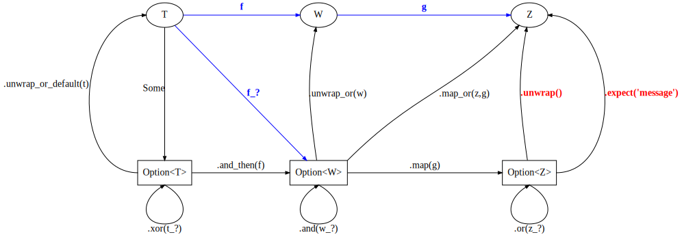

# [std::option::Option]()

This is possibly the simplest nontrivial algebraic data type. It represents an
indeterminate, uncertain, or ['maybe'](https://hackage.haskell.org/package/base-4.14.1.0/docs/Data-Maybe.html) state.


```rust

enum Option<T>{
    Some(T),
    None,

}
```

We have the following operations and methods for going between base and lifted
types. 


